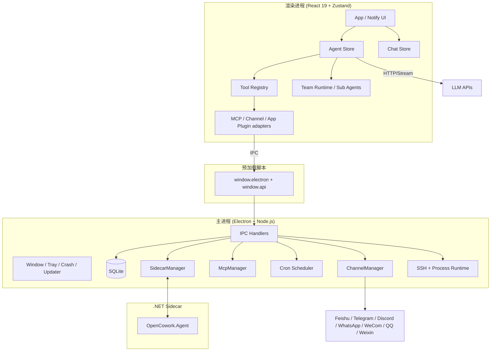

# 整体架构概述 / Architecture Overview

OpenCowork 当前是一个以 Electron 为宿主、React 为交互层、SQLite 为本地状态底座、.NET sidecar 为扩展运行时的新一代桌面 Agent 工作台。主进程负责系统能力、进程编排与持久化；渲染进程负责 UI、工具注册与 Agent 运行时；预加载脚本只暴露最小桥接面；复杂或高隔离度任务可下沉到 sidecar 或独立 worker。

## 架构图 / Architecture Diagram

## 分层职责 / Layer Responsibilities

### 主进程 (`src/main/`)

| 模块 | 职责 |
| --- | --- |
| `index.ts` | 应用启动、窗口/托盘、IPC 注册、代理与缓存配置、托管服务初始化 |
| `ipc/` | 文件、Shell、数据库、Git、通知、截图、OAuth、MCP、Cron、Team Runtime、Sidecar 等领域处理器 |
| `channels/` | 多消息平台接入、解析器注册、自动回复链路、插件化平台适配 |
| `cron/` | 定时任务调度、恢复持久化任务、执行记录 |
| `db/` | SQLite 建表、迁移、DAO |
| `mcp/` | MCP Server 生命周期与工具接入 |
| `ssh/` | SSH 会话与远程执行能力 |
| `image/` | 图像下载、剪贴板、GIF 等系统能力 |
| `window-ipc.ts` | 向窗口安全推送主进程事件 |
| `updater.ts` / `crash-logger.ts` | 自动更新与崩溃诊断 |

### 预加载脚本 (`src/preload/`)

| 模块 | 职责 |
| --- | --- |
| `index.ts` | 暴露标准 Electron API 与自定义 `window.api` |
| `window.api.*` | 图像能力、Team Runtime、独立 Team Worker 等最小必要桥接 |

### 渲染进程 (`src/renderer/src/`)

| 模块 | 职责 |
| --- | --- |
| `App.tsx` / `main.tsx` | 主窗口与通知窗口渲染入口 |
| `lib/agent/` | Agent loop、流式响应、上下文压缩、审批、子代理、团队协作 |
| `lib/tools/` + `lib/agent/tool-registry.ts` | 工具定义、注册、执行与审批策略 |
| `lib/mcp/` / `lib/channel/` / `lib/app-plugin/` | 外部能力与桌面工具接入层 |
| `stores/` | chat、agent、provider、settings、task、plan、team、cron、mcp、ssh、resources 等状态域 |
| `components/` / `hooks/` | UI 组件与交互逻辑 |

### Sidecar (`src/dotnet/OpenCowork.Agent/`)

| 模块 | 职责 |
| --- | --- |
| `Program.cs` | sidecar 进程入口 |
| `Engine/` | Agent 执行引擎 |
| `Providers/` | 模型提供商实现 |
| `Tools/` | sidecar 内工具实现 |
| `SubAgents/` | 子代理运行能力 |
| `Protocol/` | Electron 与 sidecar 之间的协议定义 |

## 核心设计要点 / Key Design Choices

- **本地优先**：会话、任务、计划、项目、定时任务、Wiki、SSH 连接等都落 SQLite。
- **进程边界清晰**：系统访问集中在主进程，UI 与 Agent 编排保留在渲染进程。
- **多运行时协作**：默认 Agent 在前端运行；需要更强隔离、桌面控制或高性能场景时，可经主进程转发到 sidecar / worker。
- **项目化工作空间**：数据模型已从单纯 session 扩展到 `project -> session`，支持本地目录、SSH、插件来源。
- **可插拔扩展**：消息平台、MCP、技能、命令、提示词、应用插件都通过注册式架构接入。

## 关键数据流 / Data Flow

1. 你在 UI 中发起消息或操作。
2. `chat-store` / `agent-store` 更新前端运行时状态。
3. Agent 直接请求模型 API，流式接收文本、思考与工具事件。
4. 工具执行按能力路由到本地注册工具、MCP、主进程 IPC、Team Runtime 或 sidecar。
5. 主进程负责数据库写入、系统调用、定时任务、平台消息、SSH 与 sidecar 编排。
6. 执行结果回流到 store，再驱动主窗口、通知窗口或外部消息平台输出。
